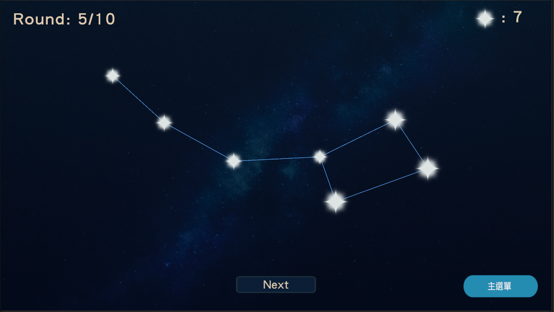
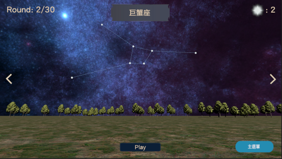

# Unity-Constellation-Memory-Game

This project is a Unity-based game designed to support **cognitive training** through an interactive constellation memory task. Players memorize the sequence of appearance of "stars" (white orbs) and click them in the correct order to form constellations.

> **Note:** This repository contains the **core C# scripts** of the project to demonstrate the logic and implementation details. The full Unity project files are not included.

## 🎮 Gameplay Demos
Click the images below to watch the demonstration videos on YouTube:

| 2D Version | 3D Version |
| :--- | :--- |
|  |  |
| :--- | :--- |
| (https://youtu.be/ZMIIgr2Lnhk) | (https://youtu.be/MQpYYYzcbck) |

## 🎮 Game Overview
"順向點擊" (Click In Order) is a game themed around the night sky. 
* **Gameplay**: Memorize the sequence of white orbs and click them to reveal stars. Correct sequences form constellations.
* **Progression**: Difficulty scales by increasing the number of orbs and the complexity of the constellation patterns.
* **Platforms**: Supported on Android and Windows.
* **Data-Driven Insights**: The system automatically tracks every click event and reaction time, providing actionable data for cognitive progress analysis.  

## ⚙️ Technical Highlights

### 1. Game Flow Management
* **ConstellationRenderer.cs**: The core brain of the game. It handles the game state, orb spawning, input validation, score tracking, and 3D level switching logic.
* **CircleToStar.cs**: Manages the visual transition animation when an orb is clicked and transformed into a star.

### 2. UI & User Experience
* **GameSettingsManager.cs**: Manages player configurations from the main menu (difficulty, initial orb count, etc.) using UI Dropdowns.
* **ShowRound.cs**: Updates the real-time HUD, displaying the current round progress and total count of stars.
* **Navigation**: Handles scene transitions (`BackToMENU`) and game restart logic (`EndGame`).

### 3. Data Structure
* **Constellation/Star Classes**: Defines the data structure for constellations, including coordinate mapping and connection logic to render the night sky patterns correctly.

## 📦 Core Scripts
| Script | Description |
| :--- | :--- |
| `ConstellationRenderer.cs` | Controls game flow, logic, and data storage. |
| `GameSettingsManager.cs` | Manages menu settings and player preferences. |
| `CircleToStar.cs` | Handles orb-to-star visual feedback animations. |
| `ShowRound.cs` | Manages real-time UI round and score updates. |
| `Constellation.cs` | Defines constellation data and star coordination. |

## 🚀 Setup & Requirements
* **Unity Version**: 2021.3.44f1
* **Platform**: Android, Windows
